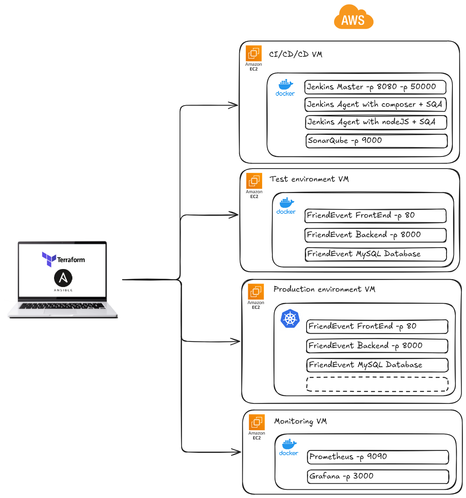
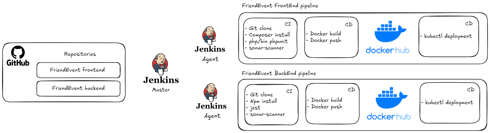

# friendevent_deployment

# Infrastructure plan


# Pipeline process


# Require
- Terraform CLI installed
- AWS CLI installed
- Docker engine installed

# Provision machines with Terraform
Create an IAM user on AWS with EC2 Full Access authorisation
```
export AWS_ACCESS_KEY_ID=YOUR_KEY
export AWS_SECRET_ACCESS_KEY=YOUR_KEY
```
Change directory to Terraform and generate an SSH key pair
```
cd Terraform
ssh-keygen -t rsa -b 2048 -f my-key
```

Deploy machines and get the public dns
```
terraform init
terraform plan
terraform apply
```

Try to connect to your machine
```
chmod 400 "my-key"
ssh -i "my-key" ubuntu@<public_dns>
```

# Configure machine with Ansible
Change all host in the Ansible/inventory.ini
```
ubuntu@<..._public_dns> ansible_ssh_private_key_file=../Terraform/my-key
```

Run the playbook
```
ansible-playbook playbook.yaml -i inventory.ini
```

This playbook will install Docker in all remote VM, then :
- On CICDCD a Jenkins and Sonarqube container
- On Test nothing else
- On Production minikube
- On Monitoring Prometheus and Grafana

# Prepare CI/CD/CD environment

Finalise the configuration of the Jenkins master on http://<public_dns>:8080

Get the secret to finish the configuration
```
ssh -i "my-key" ubuntu@<public_dns>
sudo docker logs jenkins_master
```

Build Jenkins agent image on remote VM
```
sudo docker build ./composer -t jenkins_agent_composer
sudo docker build ./nodeJS -t jenkins_agent_nodejs
```

Add new node in Jenkins Dashboard then link new jenkins agent for friendevent_backend and friendevent_frontend
```
sudo docker inspect jenkins_master
sudo docker run --init --name jenkins_agent_composer_container jenkins_agent_composer -d -url http://jenkins-server:port <secret> <agent name>
sudo docker run --init -d --name jenkins_agent_node_container jenkins_agent_nodejs -url http://172.17.0.2:8080  <secret> <agent name>
```

Create a job pipeline on Jenkins for friendevent_backend & friendevent_frontend

TO DO : fix the jenkins node agent